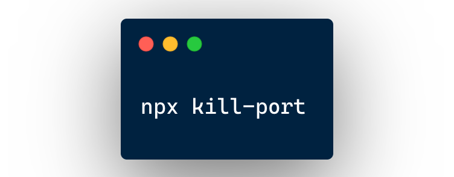

<div align="center">
  
</div>
<h1 align="center">kill-port</h1>
<div align="center">
  <strong>Kill process running on given por</strong>
</div>
<br>
<div align="center">
  <a href="https://npmjs.org/package/kill-port">
    
  </a>
  <a href="https://npmjs.org/package/kill-port">
    
  </a>
  <a href="https://github.com/feross/standard">
    
  </a>
  <a href="https://travis-ci.org/tiaanduplessis/kill-port">
    
  </a>
  <a href="https://github.com/tiaanduplessis/kill-port/blob/master/LICENSE">
    
  </a>
  <a href="http://makeapullrequest.com">
    
  </a>
</div>
<br>


## Table of Contents
- [Table of Contents](#table-of-contents)
- [Install](#install)
- [Usage](#usage)
- [API](#api)
- [CLI](#cli)
- [Contributing](#contributing)
- [License](#license)

## Install


With `npm`:
```sh
npm install --save kill-port
```

With `yarn`:
```sh
yarn add kill-port
```

With `pnpm`:
```sh
pnpm add kill-port
```

## Usage

```js

const kill = require('kill-port')
const http = require('http')
const port = 8080

const server = http.createServer((req, res) => {
  res.writeHead(200, {
    'Content-Type': 'text/plain'
  })

  res.end('Hi!')
})

server.listen(port, () => {
  setTimeout(() => {
    
    // Currently you can kill ports running on TCP or UDP protocols
    kill(port, 'tcp')
      .then(console.log)
      .catch(console.log)
  }, 1000)
})

```

## API

The module exports a single function that takes a port number as argument. It returns a promise.

## CLI

```sh
$ npm install --global kill-port
# OR
$ yarn global add kill-port
```

Then:

```sh
$ kill-port --port 8080
# OR
$ kill-port 9000
# OR you can use UDP
$ kill-port 9000 --method udp
```

You can also kill multiple ports:

```sh
$ kill-port --port 8080,5000,3000
# OR
$ kill-port 9000 3000 5000
```

## Contributing

Got an idea for a new feature? Found a bug? Contributions are welcome! Please [open up an issue](https://github.com/tiaanduplessis/feature-flip/issues) or [make a pull request](https://makeapullrequest.com/).

## License

[MIT © Tiaan du Plessis](./LICENSE)
