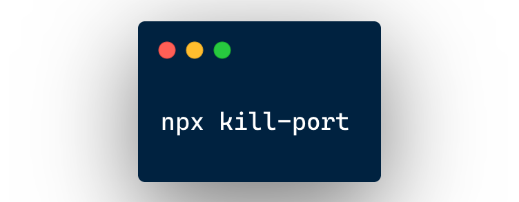

<div align="center">
  
</div>
<h1 align="center">kill-port</h1>
<div align="center">
  <strong>Kill process running on given port</strong>
</div>
<br>
<div align="center">
  <a href="https://npmjs.org/package/kill-port">
    
  </a>
  <a href="https://npmjs.org/package/kill-port">
    
  </a>
  <a href="https://github.com/feross/standard">
    
  </a>
  <a href="https://travis-ci.org/tiaanduplessis/kill-port">
    
  </a>
  <a href="https://github.com/tiaanduplessis/kill-port/blob/master/LICENSE">
    
  </a>
  <a href="http://makeapullrequest.com">
    
  </a>
</div>
<br>


## Table of Contents
- [Table of Contents](#table-of-contents)
- [Install](#install)
- [Usage](#usage)
- [API](#api)
- [CLI](#cli)
- [Contributing](#contributing)
- [License](#license)

## Install


With `npm`:
```sh
npm install --save kill-port
```

With `yarn`:
```sh
yarn add kill-port
```

With `pnpm`:
```sh
pnpm add kill-port
```

## Usage

```js

const kill = require('kill-port')
const http = require('http')
const port = 8080

const server = http.createServer((req, res) => {
  res.writeHead(200, {
    'Content-Type': 'text/plain'
  })

  res.end('Hi!')
})

server.listen(port, () => {
  setTimeout(() => {
    
    // Currently you can kill ports running on TCP or UDP protocols
    kill(port, 'tcp')
      .then(console.log)
      .catch(console.log)
  }, 1000)
})

```

## API

The module exports a single function that takes a port number as argument. It returns a promise.

## CLI

You can use `kill-port` as a global package.

Install the package globally:

```sh
$ npm install --global kill-port
# OR
$ yarn global add kill-port
```

Then:

```sh
$ kill-port --port 8080
# OR
$ kill-port 9000
# OR you can use UDP
$ kill-port 9000 --method udp
```

You can also kill multiple ports:

```sh
$ kill-port --port 8080,5000,3000
# OR
$ kill-port 9000 3000 5000
```

Use `--quiet` to suppress success messages (including verbose success details).
Errors are still reported, and exit behavior is unchanged:

```sh
$ kill-port --quiet 9000
$ kill-port --port 8080,5000,3000 --quiet
```

You can also use [npx](https://nodejs.dev/learn/the-npx-nodejs-package-runner) to `kill-port` without installing:

```sh
# Kill a single port
$ npx kill-port --port 8080
$ npx kill-port 8080
# Use UDP
$ npx kill-port 9000 --method udp
# Kill multiple ports
$ npx kill-port --port 8080,5000,3000
$ npx kill-port 9000 3000 5000
```

### Port ranges

The CLI accepts inclusive, ascending ranges in positional arguments or `--port`:

```sh
$ kill-port 3000-3005
$ kill-port --port 3000-3005
$ kill-port 3000,4000-4002 5000-5001
$ kill-port --quiet --port 3000-3005 --method udp
```

Every port and range endpoint must be an integer between 1 and 65535. Reversed,
empty, malformed, and out-of-bounds selections are rejected before any processes
are inspected or terminated, with exit status 1. At most 65535 ports (including
repeated ports) may be selected in one invocation, and at most four ports are
processed concurrently. Command failures identify the individual port that failed,
including within lists and ranges; existing command-failure exit behavior is unchanged. The JavaScript API continues to accept one port at a time.

### Signal selection

On Unix-like platforms, choose `SIGHUP`, `SIGINT`, `SIGQUIT`, `SIGABRT`,
`SIGKILL`, or `SIGTERM`. Names are case-sensitive; the default is `SIGKILL`.
The JavaScript API accepts the signal as its third argument:

```js
const kill = require('kill-port')
kill(3000, 'tcp', 'SIGINT').then(console.log).catch(console.error)
```

```sh
$ kill-port --signal SIGTERM 3000
$ kill-port --quiet --signal SIGINT --port 3000-3005
```

Signal numbers are resolved using the current platform's Node.js signal constants.
Invalid or unavailable signals reject before any process is inspected or signaled.
The CLI reports invalid signal selections with exit status 1. A successful
non-`SIGKILL` request reports that the signal was sent: it does not wait for the
process to exit or guarantee that it will exit, and never escalates to `SIGKILL`.

Windows continues to use `TaskKill /F` for the default or explicit `SIGKILL`.
Other signals reject with `Only SIGKILL is supported on Windows`; they are never
silently replaced by forced termination. `TaskKill` cannot deliver the Unix
signal semantics requested here.

## Contributing

Got an idea for a new feature? Found a bug? Contributions are welcome! Please [open up an issue](https://github.com/tiaanduplessis/feature-flip/issues) or [make a pull request](https://makeapullrequest.com/).

## License

[MIT © Tiaan du Plessis](./LICENSE)
